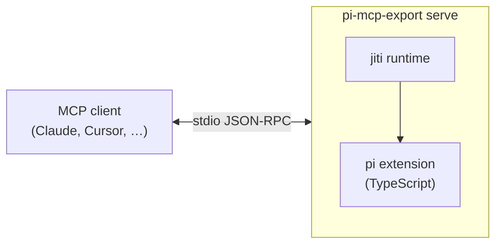

# pi-mcp-export

> [!WARNING]
> **Status: proof of concept.** Not published to npm yet, no tagged releases, and the CLI surface may change without notice. Run from a local checkout and expect rough edges while the API stabilizes.

### Expose pi extensions as MCP servers

**[Install](#install)** · **[Usage](#usage)** · **[How it works](#how-it-works)**

> _Point it at a pi extension; any MCP client can call its tools and commands._

An adapter for **[pi](https://pi.dev/)** — an AI coding agent that runs in your terminal. pi extensions are TypeScript modules that register tools, commands, and event hooks. `pi-mcp-export` loads an extension and exposes it as an [MCP](https://modelcontextprotocol.io/) stdio server, so the same extension works in Claude Desktop, Cursor, Codex, Hermes, and any other MCP-compatible client — no per-client rewrite.

---

## Quick start

```bash
git clone https://github.com/sotayamashita/pi-mcp-export.git && cd pi-mcp-export
pnpm install

node bin/pi-mcp-export.mjs serve --extension /path/to/extension
```

## What's included

| Command       | Description                                                                 |
| ------------- | --------------------------------------------------------------------------- |
| **`serve`**   | MCP stdio server that mirrors a pi extension's tools, commands, and hooks   |
| **`inspect`** | Pre-flight report of what an extension registers and what the adapter skips |

### Subcommands

| Subcommand                                                     | Description                                                                                                                          |
| -------------------------------------------------------------- | ------------------------------------------------------------------------------------------------------------------------------------ |
| `serve --extension <path>... [--strict] [--timeout <seconds>]` | Start the MCP stdio server. `--strict` rejects unsupported registrations at load time; `--timeout` caps each tool call (0 disables). |
| `inspect --extension <path>... [--format text\|json]`          | Load the extension without opening a server and report tools, commands, event hooks, and any unsupported API usage.                  |

### What's forwarded

| pi ExtensionAPI                    | MCP mapping                                |
| ---------------------------------- | ------------------------------------------ |
| `pi.registerTool`                  | `tools/list` + `tools/call`                |
| `pi.registerCommand("x", …)`       | tool named `command_x`                     |
| `pi.on("session_start\|shutdown")` | server init / close                        |
| `pi.on("tool_call")`               | pre-hook, fail-closed block                |
| `pi.on("tool_result")`             | post-hook, can override the result         |
| `onUpdate`                         | `notifications/progress`                   |
| `ctx.ui.notify`                    | `logging` notification                     |
| `ctx.cwd` / `ctx.signal`           | server cwd / per-call `AbortSignal`        |
| `pi.exec`                          | `child_process.spawn` (SIGTERM→500ms→KILL) |

No-ops (no MCP equivalent): `ctx.ui.confirm/select/input/setWidget/custom`, `registerShortcut`, and agent-lifecycle events (`agent_start`, `turn_start`, …). Run with `--strict` to reject them at load time.

---

## Install

Proof of concept — run from a local checkout until the first tagged release hits npm.

```bash
git clone https://github.com/sotayamashita/pi-mcp-export.git
cd pi-mcp-export
pnpm install
```

<details>
<summary>Requirements</summary>

- [mise](https://mise.jdx.dev/) picks up `node` (LTS) and `pnpm` from [`mise.toml`](mise.toml)
- A pi extension — a single `.ts` file or a directory containing `index.ts`

</details>

---

## Usage

### 1. Point the server at an extension

```bash
node bin/pi-mcp-export.mjs serve --extension /path/to/extension
```

Multiple extensions load together — repeat `--extension` as needed.

### 2. Wire it into an MCP client

```json
{
  "mcpServers": {
    "my-pi-extension": {
      "command": "node",
      "args": [
        "/absolute/path/to/pi-mcp-export/bin/pi-mcp-export.mjs",
        "serve",
        "--extension",
        "/absolute/path/to/extension"
      ]
    }
  }
}
```

### 3. Inspect before wiring

```bash
node bin/pi-mcp-export.mjs inspect --extension /path/to/extension --format json
```

The JSON output lists every tool, command, and event subscription — plus anything the adapter can't forward — so you know exactly what the client will see.

---

## How it works



The extension is evaluated at runtime via [jiti](https://github.com/unjs/jiti); no pre-build step. Each `tools/call` routes through a dispatcher that runs `tool_call` pre-hooks (fail-closed), executes the tool with an `AbortSignal` scoped to that call, then runs `tool_result` post-hooks for audit/override. Progress callbacks are forwarded as MCP `notifications/progress`, and `ctx.ui.notify` is forwarded as MCP `logging` notifications.

---

## License

[Apache-2.0](LICENSE)
